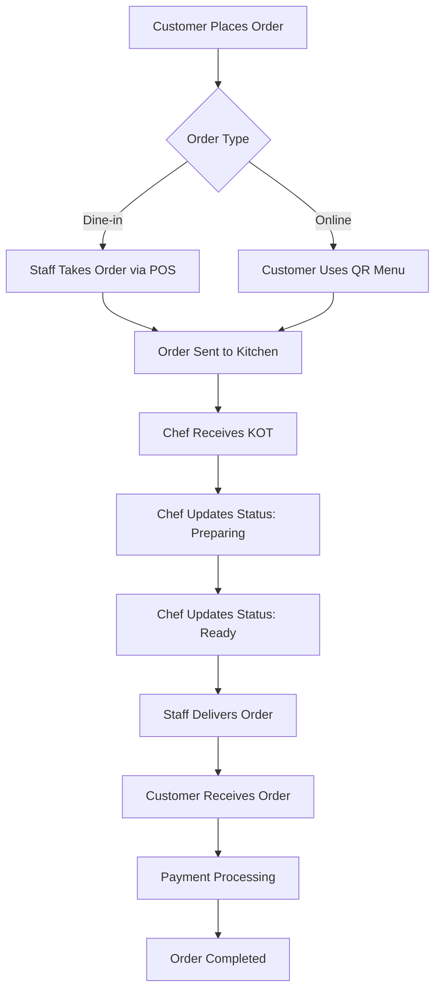
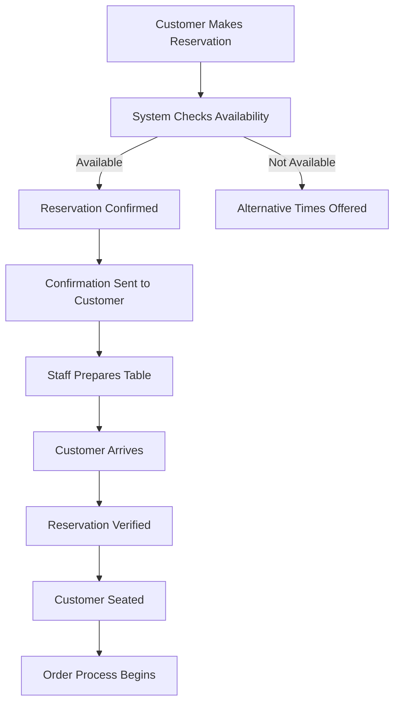
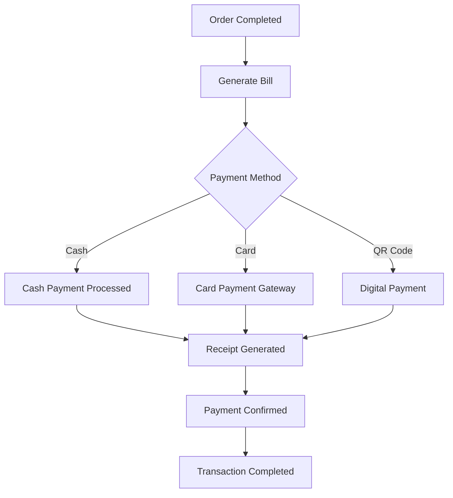
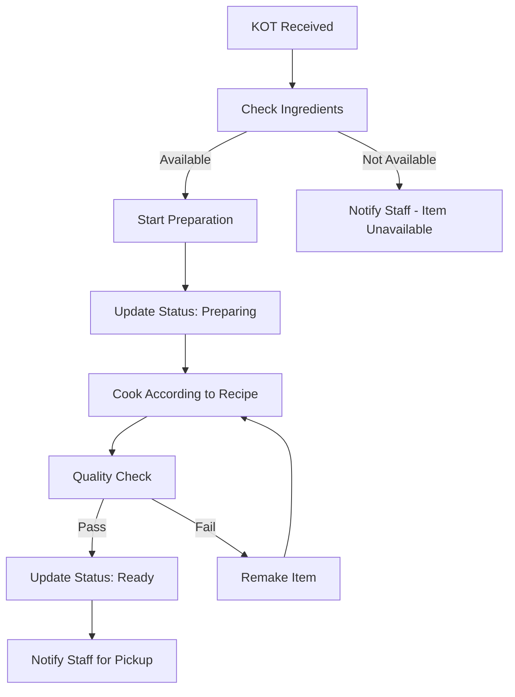

# TableTrack User Rules & Guidelines

## 📋 Daftar Isi
1. [Pengantar](#pengantar)
2. [Jenis Pengguna & Peran](#jenis-pengguna--peran)
3. [Aturan Umum Penggunaan](#aturan-umum-penggunaan)
4. [Panduan untuk Super Admin](#panduan-untuk-super-admin)
5. [Panduan untuk Admin Restoran](#panduan-untuk-admin-restoran)
6. [Panduan untuk Branch Head](#panduan-untuk-branch-head)
7. [Panduan untuk Staff/Waiter](#panduan-untuk-staffwaiter)
8. [Panduan untuk Chef](#panduan-untuk-chef)
9. [Panduan untuk Customer](#panduan-untuk-customer)
10. [Workflow Operasional](#workflow-operasional)
11. [Keamanan & Privasi](#keamanan--privasi)
12. [Troubleshooting](#troubleshooting)

---

## 🎯 Pengantar

**TableTrack** adalah sistem manajemen restoran yang komprehensif yang dirancang untuk memudahkan operasional restoran dari pemesanan hingga pembayaran. Dokumen ini berisi panduan lengkap untuk semua jenis pengguna dalam menggunakan sistem TableTrack dengan efektif dan aman.

### Tujuan Dokumen
- Memberikan panduan penggunaan yang jelas untuk setiap peran pengguna
- Menetapkan aturan dan prosedur operasional standar
- Memastikan keamanan dan integritas data
- Meningkatkan efisiensi operasional restoran

---

## 👥 Jenis Pengguna & Peran

### 1. Super Admin
**Akses Level**: Tertinggi - Mengelola seluruh sistem
**Tanggung Jawab**:
- Mengelola semua restoran dalam sistem
- Mengatur paket berlangganan dan pembayaran
- Mengelola pengaturan global sistem
- Monitoring performa sistem secara keseluruhan

### 2. Admin Restoran
**Akses Level**: Tinggi - Mengelola restoran tertentu
**Tanggung Jawab**:
- Mengelola seluruh operasional restoran
- Mengatur menu, harga, dan promosi
- Mengelola staff dan jadwal kerja
- Mengakses laporan dan analitik lengkap

### 3. Branch Head
**Akses Level**: Menengah-Tinggi - Mengelola cabang tertentu
**Tanggung Jawab**:
- Mengelola operasional harian cabang
- Supervisi staff dan customer service
- Mengelola inventori dan stok
- Laporan cabang kepada Admin Restoran

### 4. Staff/Waiter
**Akses Level**: Menengah - Operasional harian
**Tanggung Jawab**:
- Melayani customer dan mengambil pesanan
- Mengoperasikan sistem POS
- Mengelola meja dan reservasi
- Koordinasi dengan kitchen untuk pesanan

### 5. Chef
**Akses Level**: Terbatas - Kitchen operations
**Tanggung Jawab**:
- Menerima dan memproses Kitchen Order Tickets (KOT)
- Update status pesanan (preparing, ready, completed)
- Mengelola workflow dapur
- Koordinasi dengan staff untuk delivery pesanan

### 6. Customer
**Akses Level**: Terbatas - Self-service
**Hak Akses**:
- Melihat menu dan harga
- Melakukan pemesanan online
- Melakukan reservasi meja
- Melihat riwayat pesanan dan pembayaran

---

## 📋 Aturan Umum Penggunaan

### 1. Keamanan Akun
- **Password Policy**: Minimum 8 karakter dengan kombinasi huruf, angka, dan simbol
- **Login Security**: Maksimal 3 percobaan login gagal sebelum akun dikunci sementara
- **Session Management**: Auto-logout setelah 30 menit tidak aktif
- **Multi-Device**: Satu akun hanya boleh login di maksimal 2 device bersamaan

### 2. Data Integrity
- **Backup Data**: Sistem melakukan backup otomatis setiap 24 jam
- **Data Validation**: Semua input data harus melalui validasi sistem
- **Audit Trail**: Semua perubahan data penting dicatat dalam log audit
- **Data Retention**: Data transaksi disimpan minimum 3 tahun

### 3. Operational Hours
- **System Maintenance**: Setiap Minggu 02:00-04:00 WIB
- **Support Hours**: Senin-Jumat 09:00-18:00 WIB
- **Emergency Support**: 24/7 untuk critical issues
- **Update Schedule**: Update sistem dilakukan setiap 2 minggu

### 4. Performance Guidelines
- **Response Time**: Maksimal 3 detik untuk operasi standar
- **Concurrent Users**: Sistem mendukung hingga 100 user bersamaan per restoran
- **File Upload**: Maksimal 5MB per file untuk gambar menu
- **Database Queries**: Optimasi query untuk performa maksimal

---

## 🔧 Panduan untuk Super Admin

### Akses & Permissions
```
✅ Mengelola semua restoran
✅ Mengatur paket dan billing
✅ Mengelola currency dan payment gateway
✅ Akses laporan global
✅ Mengelola user super admin lainnya
✅ Mengatur theme dan branding global
```

### Tugas Utama

#### 1. Restaurant Management
- **Onboarding Restoran Baru**:
  1. Verifikasi dokumen restoran
  2. Setup initial configuration
  3. Assign package yang sesuai
  4. Training admin restoran
  
- **Monitoring Performance**:
  1. Review monthly performance reports
  2. Identify underperforming restaurants
  3. Provide support dan recommendations
  4. Monitor subscription renewals

#### 2. System Administration
- **Package Management**:
  ```
  - Free Package: Basic features, 1 branch, 5 tables
  - Starter Package: Advanced features, 3 branches, 20 tables
  - Professional Package: Full features, unlimited branches
  - Enterprise Package: Custom solutions, dedicated support
  ```

- **Payment Gateway Configuration**:
  ```
  - Stripe: International payments
  - Razorpay: India market
  - Paystack: African market
  - Bank Transfer: Local payments
  ```

#### 3. Compliance & Security
- **Data Protection**: Ensure GDPR compliance
- **Security Audits**: Monthly security reviews
- **Backup Verification**: Weekly backup integrity checks
- **License Management**: Track software licenses

### Best Practices
1. **Regular System Health Checks**: Daily monitoring dashboard review
2. **Customer Support**: Respond to escalated issues within 2 hours
3. **Documentation**: Keep all system changes documented
4. **Training**: Conduct monthly training sessions for restaurant admins

---

## 🏪 Panduan untuk Admin Restoran

### Akses & Permissions
```
✅ Full access untuk restoran mereka
✅ Mengelola semua staff dan branches
✅ Mengatur menu dan pricing
✅ Akses semua laporan restoran
✅ Mengelola customer data
✅ Mengatur payment methods
```

### Setup Awal Restoran

#### 1. Restaurant Profile Setup
```php
// Required Information
- Restaurant Name & Description
- Contact Information (Phone, Email, Address)
- Business Hours & Timezone
- Cuisine Type & Specialties
- Logo & Branding Materials
```

#### 2. Branch Configuration
```php
// For Each Branch
- Branch Name & Address
- Operating Hours
- Contact Details
- Seating Capacity
- Kitchen Configuration
```

#### 3. Area & Table Setup
```php
// Area Configuration
- Area Name (e.g., "Main Dining", "Patio", "VIP Room")
- Capacity & Layout
- Special Features

// Table Configuration
- Table Number/Name
- Seating Capacity (2, 4, 6, 8+ persons)
- Table Type (Regular, VIP, Outdoor)
- QR Code Generation
```

### Menu Management

#### 1. Menu Structure
```
Restaurant Menu
├── Breakfast Menu
│   ├── Main Dishes
│   ├── Beverages
│   └── Desserts
├── Lunch Menu
│   ├── Appetizers
│   ├── Main Courses
│   ├── Side Dishes
│   └── Beverages
└── Dinner Menu
    ├── Starters
    ├── Main Courses
    ├── Desserts
    └── Wine & Beverages
```

#### 2. Menu Item Configuration
```php
// Required Fields
- Item Name & Description
- Category Assignment
- Price & Currency
- Preparation Time
- Availability Status
- Dietary Information (Vegan, Gluten-Free, etc.)

// Optional Fields
- Item Image (Recommended: 800x600px)
- Variations (Size, Spice Level, etc.)
- Modifiers (Extra Cheese, No Onions, etc.)
- Nutritional Information
```

#### 3. Pricing Strategy
- **Dynamic Pricing**: Adjust prices based on demand/time
- **Happy Hour**: Special pricing for specific time periods
- **Combo Deals**: Bundle items for better value
- **Seasonal Menu**: Update menu items based on season

### Staff Management

#### 1. Role Assignment
```php
// Role Hierarchy
Admin Restoran
├── Branch Head (per cabang)
├── Staff/Waiter (per shift)
├── Chef (kitchen operations)
└── Delivery Executive (if applicable)
```

#### 2. Staff Onboarding Process
1. **Account Creation**:
   - Generate unique login credentials
   - Assign appropriate role dan permissions
   - Setup profile information
   
2. **Training Requirements**:
   - System navigation training
   - POS operation training
   - Customer service protocols
   - Emergency procedures

3. **Performance Monitoring**:
   - Daily sales targets
   - Customer satisfaction scores
   - Order accuracy rates
   - Response time metrics

### Daily Operations

#### 1. Opening Procedures
```bash
# Daily Checklist
□ Check system connectivity
□ Verify printer functionality
□ Review today's reservations
□ Check inventory levels
□ Brief staff on daily specials
□ Test payment systems
```

#### 2. Order Management
- **Dine-In Orders**: Table-based ordering via POS
- **Online Orders**: Customer self-service via QR menu
- **Reservations**: Table booking management
- **Takeaway**: Quick service orders

#### 3. Closing Procedures
```bash
# End of Day Checklist
□ Process all pending payments
□ Generate daily sales report
□ Update inventory counts
□ Backup transaction data
□ Schedule next day preparations
```

---

## 👨‍💼 Panduan untuk Branch Head

### Akses & Permissions
```
✅ Mengelola operasional cabang
✅ Supervisi staff cabang
✅ Akses laporan cabang
✅ Mengelola inventori lokal
✅ Handle customer complaints
✅ Koordinasi dengan admin restoran
```

### Tanggung Jawab Harian

#### 1. Staff Supervision
- **Shift Management**: Mengatur jadwal dan pergantian shift
- **Performance Review**: Monitor kinerja staff harian
- **Training Support**: Memberikan guidance untuk staff baru
- **Conflict Resolution**: Menyelesaikan konflik antar staff

#### 2. Customer Service
- **Quality Control**: Memastikan standar pelayanan terjaga
- **Complaint Handling**: Menangani keluhan customer dengan cepat
- **Feedback Collection**: Mengumpulkan feedback untuk improvement
- **VIP Customer Care**: Perhatian khusus untuk customer VIP

#### 3. Inventory Management
```php
// Daily Inventory Tasks
- Morning stock check
- Ingredient usage tracking
- Supplier coordination
- Waste management
- Cost control monitoring
```

### Operational Workflows

#### 1. Peak Hour Management
```php
// Rush Hour Protocol
1. Pre-rush preparation (30 minutes before)
2. Staff positioning optimization
3. Kitchen workflow coordination
4. Customer queue management
5. Quality maintenance under pressure
```

#### 2. Emergency Procedures
- **System Downtime**: Manual backup procedures
- **Staff Shortage**: Emergency staffing protocols
- **Customer Incidents**: Incident response procedures
- **Equipment Failure**: Backup equipment activation

---

## 👨‍🍳 Panduan untuk Chef

### Akses & Permissions
```
✅ Akses Kitchen Order Tickets (KOT)
✅ Update status pesanan
✅ Mengelola kitchen workflow
✅ Koordinasi dengan staff
✅ Akses inventory kitchen
```

### Kitchen Operations

#### 1. KOT Management
```php
// KOT Workflow
1. Receive new order notification
2. Review order details & special instructions
3. Check ingredient availability
4. Start preparation (update status: "Preparing")
5. Complete dish (update status: "Ready")
6. Notify staff for pickup/delivery
```

#### 2. Order Priority System
```php
// Priority Levels
1. VIP Orders (Gold customers)
2. Dine-in orders (table service)
3. Online orders (pickup/delivery)
4. Staff meals (break time)
```

#### 3. Quality Control
- **Presentation Standards**: Consistent plating dan presentation
- **Temperature Control**: Proper serving temperatures
- **Portion Control**: Standardized serving sizes
- **Freshness Check**: Ingredient quality verification

### Kitchen Workflow Optimization

#### 1. Preparation Stages
```php
// Mise en Place Protocol
Morning Prep (8:00-10:00):
- Ingredient preparation
- Sauce preparation
- Equipment setup
- Menu item availability check

Lunch Prep (10:00-11:30):
- Final preparations
- Station organization
- Team briefing
- Equipment final check
```

#### 2. Communication Protocols
- **Order Modifications**: Handle customer changes efficiently
- **Delay Notifications**: Inform staff about delays immediately
- **Special Requests**: Accommodate dietary restrictions
- **Inventory Alerts**: Report low stock immediately

---

## 🍽️ Panduan untuk Staff/Waiter

### Akses & Permissions
```
✅ Mengoperasikan POS system
✅ Mengelola table assignments
✅ Process customer orders
✅ Handle payments
✅ Akses customer information
✅ Generate bills & receipts
```

### Customer Service Excellence

#### 1. Greeting & Seating
```php
// Standard Greeting Protocol
1. Welcome customer within 30 seconds
2. Check reservation status
3. Offer table options if available
4. Provide menu & explain specials
5. Take drink orders promptly
```

#### 2. Order Taking Process
```php
// POS Operation Steps
1. Select table number
2. Add customer information (if new)
3. Input order items with modifications
4. Confirm order details with customer
5. Send order to kitchen (KOT generation)
6. Provide estimated preparation time
```

#### 3. Payment Processing
```php
// Payment Methods Supported
- Cash payments
- Credit/Debit cards
- Digital wallets (PayPal, Stripe)
- QR code payments
- Split payments (multiple methods)
```

### Table Management

#### 1. Table Status Tracking
```php
// Table States
- Available: Ready for new customers
- Occupied: Currently serving customers
- Reserved: Booked for specific time
- Cleaning: Being prepared for next customer
- Maintenance: Out of service
```

#### 2. Reservation Management
```php
// Reservation Workflow
1. Check reservation details
2. Prepare table 15 minutes before arrival
3. Greet reserved customers by name
4. Confirm reservation details
5. Provide estimated wait time if delayed
```

### Daily Responsibilities

#### 1. Opening Tasks
```bash
# Start of Shift Checklist
□ Check POS system functionality
□ Review today's reservations
□ Check table setup & cleanliness
□ Review daily specials & promotions
□ Coordinate with kitchen team
```

#### 2. Closing Tasks
```bash
# End of Shift Checklist
□ Process all pending orders
□ Clean assigned tables & area
□ Count cash drawer (if applicable)
□ Report any issues to supervisor
□ Prepare handover notes for next shift
```

---

## 👤 Panduan untuk Customer

### Akses & Fitur
```
✅ Browse menu & prices
✅ Place online orders
✅ Make table reservations
✅ Track order status
✅ Payment processing
✅ Order history
✅ Loyalty program participation
```

### Cara Menggunakan Sistem

#### 1. QR Menu Access
```php
// Steps to Order via QR Code
1. Scan QR code di meja dengan smartphone
2. Browse menu categories & items
3. Add items to cart dengan quantity
4. Review order & total amount
5. Proceed to checkout
6. Select payment method
7. Confirm order & receive confirmation
```

#### 2. Online Reservation
```php
// Reservation Process
1. Visit restaurant website/app
2. Select "Book a Table"
3. Choose date, time & party size
4. Provide contact information
5. Select special requests (if any)
6. Confirm reservation
7. Receive confirmation email/SMS
```

#### 3. Order Tracking
```php
// Order Status Updates
- Order Received: Pesanan diterima sistem
- Order Confirmed: Dikonfirmasi oleh restoran
- Preparing: Sedang dimasak di kitchen
- Ready: Siap untuk pickup/delivery
- Completed: Pesanan selesai
```

### Customer Guidelines

#### 1. Ordering Best Practices
- **Menu Review**: Baca deskripsi item dengan teliti
- **Dietary Restrictions**: Informasikan alergi atau dietary needs
- **Special Requests**: Berikan instruksi khusus jika diperlukan
- **Contact Information**: Pastikan nomor telepon aktif untuk updates

#### 2. Payment Guidelines
- **Secure Payments**: Gunakan payment methods yang aman
- **Receipt Storage**: Simpan receipt untuk referensi
- **Tip Guidelines**: Tip 10-15% untuk service yang baik
- **Dispute Resolution**: Laporkan masalah pembayaran segera

#### 3. Feedback & Reviews
- **Service Rating**: Berikan rating honest untuk service
- **Constructive Feedback**: Berikan feedback yang membangun
- **Issue Reporting**: Laporkan masalah dengan detail yang jelas
- **Appreciation**: Apresiasi service yang excellent

---

## 🔄 Workflow Operasional

### 1. Order Processing Workflow



### 2. Reservation Workflow



### 3. Payment Processing Workflow



### 4. Kitchen Operations Workflow



---

## 🔒 Keamanan & Privasi

### 1. Data Protection
```php
// Personal Data Handling
- Customer information encrypted in database
- Payment details processed via secure gateways
- Staff access limited to necessary data only
- Regular security audits conducted
- GDPR compliance maintained
```

### 2. Access Control
```php
// Role-Based Access Control (RBAC)
Super Admin:
  - Full system access
  - User management
  - System configuration

Restaurant Admin:
  - Restaurant-specific full access
  - Staff management
  - Financial reports

Branch Head:
  - Branch-specific access
  - Local staff supervision
  - Operational reports

Staff/Waiter:
  - POS operations
  - Customer service functions
  - Limited reporting access

Chef:
  - Kitchen operations only
  - Order status updates
  - Inventory access (kitchen items)

Customer:
  - Self-service functions only
  - Personal order history
  - Account management
```

### 3. Security Best Practices

#### For All Users:
- **Strong Passwords**: Minimum 8 characters, mixed case, numbers, symbols
- **Regular Updates**: Change passwords every 90 days
- **Secure Logout**: Always logout when leaving workstation
- **Suspicious Activity**: Report unusual system behavior immediately

#### For Staff:
- **Clean Desk Policy**: No sensitive information left visible
- **Screen Lock**: Lock screen when away from workstation
- **USB Restrictions**: No unauthorized USB devices
- **Email Security**: Don't click suspicious links or attachments

#### For Customers:
- **Public WiFi**: Avoid sensitive transactions on public networks
- **Device Security**: Keep devices updated with latest security patches
- **Account Monitoring**: Regularly check order history for unauthorized activity
- **Secure Payments**: Only use trusted payment methods

### 4. Incident Response
```php
// Security Incident Protocol
1. Immediate Response (0-15 minutes):
   - Identify and contain the incident
   - Notify security team
   - Document initial findings

2. Assessment (15-60 minutes):
   - Determine scope and impact
   - Identify affected systems/data
   - Notify relevant stakeholders

3. Recovery (1-24 hours):
   - Implement containment measures
   - Begin system restoration
   - Monitor for additional threats

4. Post-Incident (24+ hours):
   - Conduct thorough investigation
   - Update security measures
   - Provide incident report
   - Implement preventive measures
```

---

## 🛠️ Troubleshooting

### 1. Common Issues & Solutions

#### System Performance Issues
```php
// Slow System Response
Symptoms: Pages loading slowly, timeouts
Solutions:
1. Check internet connection stability
2. Clear browser cache and cookies
3. Restart the application
4. Contact IT support if persistent

// POS System Not Responding
Symptoms: POS freezes, orders not processing
Solutions:
1. Restart POS terminal
2. Check printer connections
3. Verify network connectivity
4. Switch to backup terminal if available
```

#### Payment Processing Issues
```php
// Payment Gateway Errors
Symptoms: Payment failures, transaction errors
Solutions:
1. Verify payment method details
2. Check internet connection
3. Try alternative payment method
4. Contact payment support

// Receipt Printing Problems
Symptoms: Receipts not printing, poor print quality
Solutions:
1. Check printer paper and ink/toner
2. Verify printer connections
3. Restart printer
4. Check printer settings in system
```

#### Order Management Issues
```php
// Orders Not Appearing in Kitchen
Symptoms: KOT not generated, kitchen not receiving orders
Solutions:
1. Check kitchen printer connectivity
2. Verify order was properly submitted
3. Manually send order to kitchen
4. Check system synchronization

// Customer Order Tracking Issues
Symptoms: Order status not updating, incorrect information
Solutions:
1. Refresh order status manually
2. Verify order details in system
3. Contact customer service
4. Provide manual updates to customer
```

### 2. Emergency Procedures

#### System Downtime Protocol
```php
// When System is Completely Down
1. Immediate Actions:
   - Switch to manual order taking
   - Use backup payment methods (cash)
   - Document all transactions manually
   - Notify customers about temporary issues

2. Communication:
   - Inform all staff about downtime
   - Update customers about delays
   - Contact technical support immediately
   - Provide regular status updates

3. Recovery:
   - Test system functionality before resuming
   - Input manual transactions into system
   - Verify all data integrity
   - Resume normal operations gradually
```

#### Data Loss Prevention
```php
// Backup and Recovery Procedures
Daily Backups:
- Automatic system backup at 2:00 AM
- Transaction data backed up every 4 hours
- Critical data replicated in real-time

Recovery Process:
1. Identify scope of data loss
2. Determine last successful backup
3. Restore from most recent backup
4. Verify data integrity
5. Resume operations with monitoring
```

### 3. Contact Information

#### Technical Support
```
Level 1 Support (General Issues):
- Email: support@tabletrack.com
- Phone: +1-800-TABLETRACK
- Hours: 24/7
- Response Time: Within 2 hours

Level 2 Support (Critical Issues):
- Email: critical@tabletrack.com
- Phone: +1-800-CRITICAL
- Hours: 24/7
- Response Time: Within 30 minutes

Level 3 Support (System Emergencies):
- Email: emergency@tabletrack.com
- Phone: +1-800-EMERGENCY
- Hours: 24/7
- Response Time: Within 15 minutes
```

#### Business Support
```
Account Management:
- Email: accounts@tabletrack.com
- Phone: +1-800-ACCOUNTS
- Hours: Monday-Friday, 9 AM - 6 PM

Billing Support:
- Email: billing@tabletrack.com
- Phone: +1-800-BILLING
- Hours: Monday-Friday, 9 AM - 6 PM

Training & Onboarding:
- Email: training@tabletrack.com
- Phone: +1-800-TRAINING
- Hours: Monday-Friday, 8 AM - 8 PM
```

---

## 📊 Performance Metrics & KPIs

### 1. System Performance Metrics
```php
// Technical KPIs
- System Uptime: Target 99.9%
- Page Load Time: Target < 3 seconds
- Transaction Processing: Target < 5 seconds
- Database Response: Target < 1 second
- API Response Time: Target < 2 seconds
```

### 2. Business Performance Metrics
```php
// Restaurant KPIs
- Order Accuracy Rate: Target > 95%
- Customer Satisfaction: Target > 4.5/5
- Table Turnover Rate: Varies by restaurant type
- Average Order Value: Track monthly trends
- Payment Success Rate: Target > 98%
```

### 3. User Experience Metrics
```php
// UX KPIs
- User Login Success Rate: Target > 99%
- Feature Adoption Rate: Track new feature usage
- Support Ticket Volume: Target < 5% of active users
- Training Completion Rate: Target > 90%
- User Retention Rate: Target > 85%
```

---

## 📈 Continuous Improvement

### 1. Feedback Collection
```php
// Feedback Channels
- In-app feedback forms
- Monthly user surveys
- Customer service interactions
- Staff suggestion system
- Performance analytics review
```

### 2. Training & Development
```php
// Ongoing Training Programs
- Monthly feature updates training
- Quarterly best practices workshops
- Annual system optimization review
- New user onboarding program
- Advanced feature certification
```

### 3. System Updates
```php
// Update Schedule
- Security patches: As needed (immediate)
- Bug fixes: Weekly releases
- Feature updates: Bi-weekly releases
- Major versions: Quarterly releases
- System maintenance: Weekly (scheduled)
```

---

## 📝 Compliance & Legal

### 1. Data Privacy Compliance
```php
// GDPR Compliance
- Right to access personal data
- Right to rectify incorrect data
- Right to erase personal data
- Right to restrict processing
- Right to data portability
- Right to object to processing
```

### 2. Financial Compliance
```php
// PCI DSS Compliance
- Secure payment processing
- Encrypted cardholder data
- Regular security testing
- Access control measures
- Network security monitoring
```

### 3. Industry Standards
```php
// Restaurant Industry Compliance
- Food safety regulations adherence
- Health department requirements
- Labor law compliance
- Tax reporting requirements
- Accessibility standards (ADA)
```

---

## 🔄 Version Control & Updates

### Current Version: v1.2.43
**Release Date**: [Current Date]
**Next Update**: [Scheduled Date]

### Recent Updates
- Enhanced security features
- Improved payment processing
- Better mobile responsiveness
- Advanced reporting capabilities
- Multi-language support expansion

### Upcoming Features
- AI-powered analytics
- Advanced inventory management
- Enhanced customer loyalty program
- Improved kitchen workflow automation
- Mobile app for customers

---

## 📞 Support & Resources

### Documentation
- User Manual: Available in system help section
- Video Tutorials: Access via training portal
- FAQ Database: Searchable knowledge base
- Best Practices Guide: Industry-specific recommendations

### Community
- User Forum: Connect with other restaurant owners
- Feature Requests: Submit suggestions for improvements
- Success Stories: Learn from other users' experiences
- Webinar Series: Monthly training sessions

---

*Dokumen ini harus diupdate secara berkala seiring dengan perkembangan sistem dan perubahan kebutuhan operasional. Untuk pertanyaan atau saran perbaikan dokumen, silakan hubungi tim dokumentasi di docs@tabletrack.com*

**Terakhir diupdate**: [Current Date]
**Versi Dokumen**: 1.0
**Review Berikutnya**: [Next Review Date]